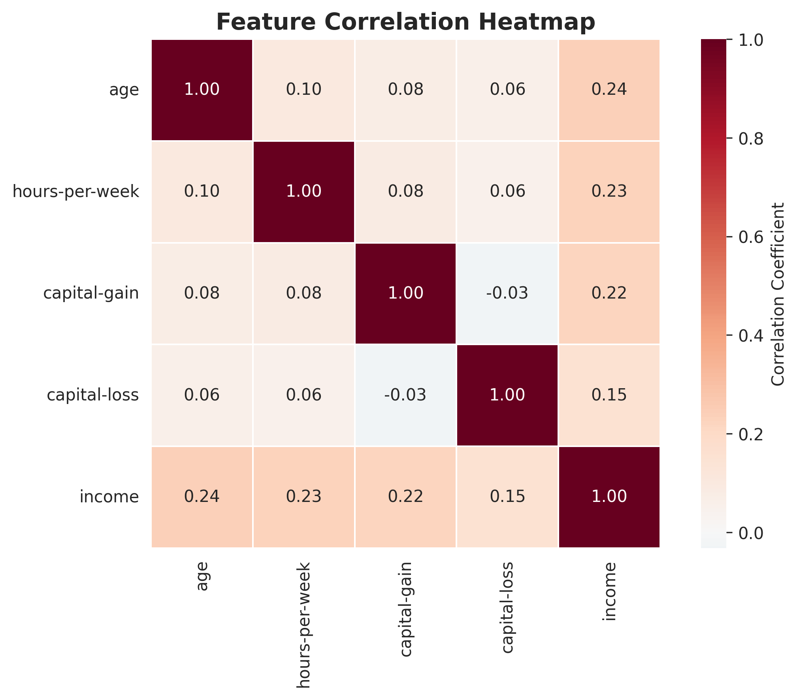
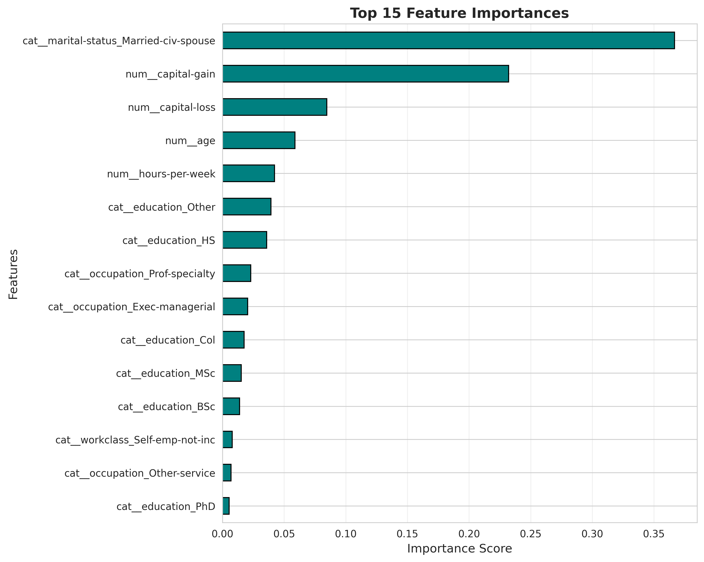
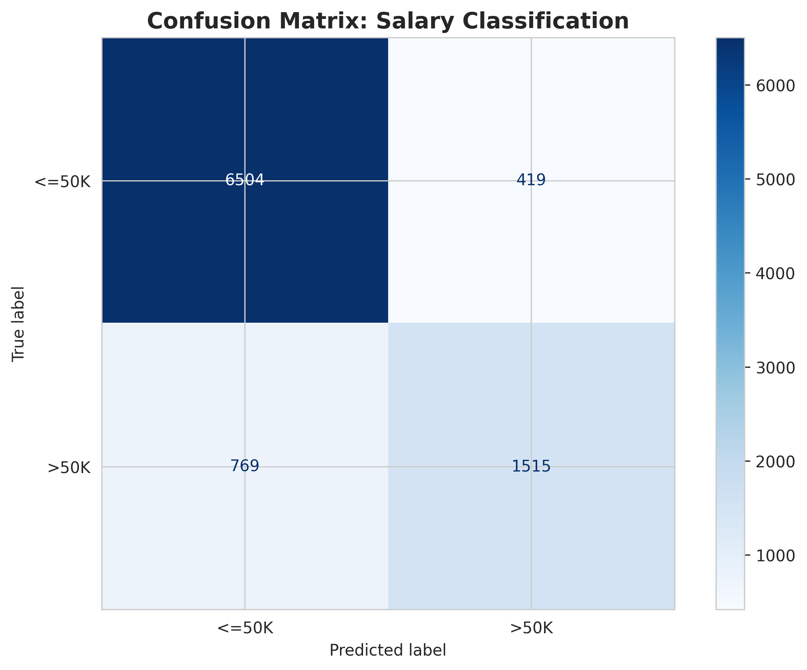
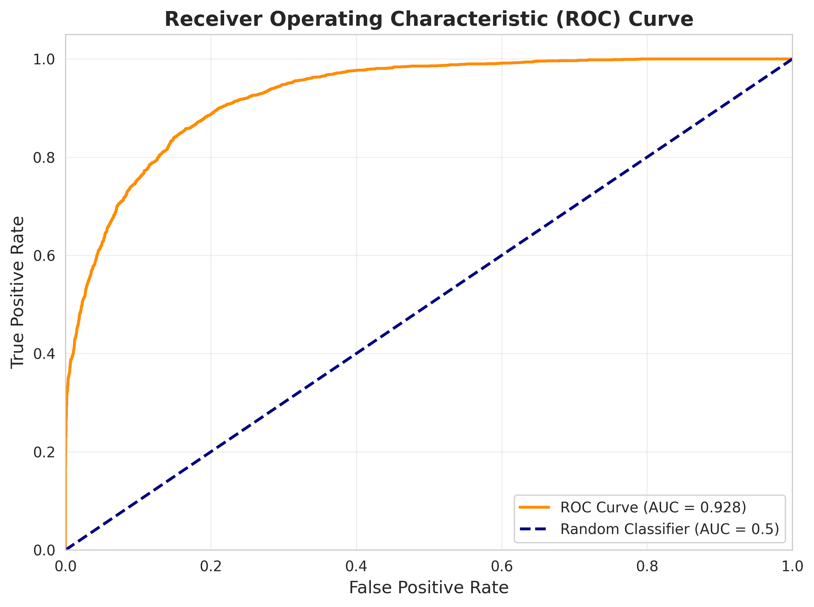

# 💼 Salary Prediction — Adult Dataset

> Binary classification project predicting whether an individual's annual income exceeds **$50K** based on demographic and employment attributes from the UCI Adult Census dataset.


---

## 📑 Table of Contents
- [Overview](#-overview)
- [Dataset](#-dataset)
- [Project Workflow](#-project-workflow)
- [Tech Stack](#-tech-stack)
- [Project Structure](#-project-structure)
- [Installation](#%EF%B8%8F-installation)
- [Usage](#%EF%B8%8F-usage)
- [Exploratory Data Analysis](#-exploratory-data-analysis)
- [Modeling](#-modeling)
- [Results](#-results)
- [Model Evaluation](#-model-evaluation)
- [Conclusion](#-conclusion)
- [Future Improvements](#-future-improvements)
- [Author](#-author)
- [License](#-license)

---

## 📌 Overview

This project applies supervised machine learning to predict whether a person earns **more than $50K per year** using the well-known **UCI Adult Census Income** dataset. The pipeline covers data cleaning, exploratory data analysis (EDA), feature engineering, model training, hyperparameter tuning, and evaluation — all packaged in a reproducible workflow suitable for portfolio and internship presentation.

---

## 📊 Dataset
- **Source:** [UCI Machine Learning Repository — Adult Dataset](https://archive.ics.uci.edu/ml/datasets/adult)
- **Records:** ~48,842 instances
- **Features:** 14 demographic and employment attributes
- **Target:** `income` — `<=50K` or `>50K`

**Key Features**
- `age`, `workclass`, `education`, `education-num`
- `marital-status`, `occupation`, `relationship`
- `race`, `sex`, `capital-gain`, `capital-loss`
- `hours-per-week`, `native-country`

---

## 🔁 Project Workflow
1. **Data Loading & Inspection**
2. **Data Cleaning** — handling missing values & duplicates
3. **Exploratory Data Analysis (EDA)**
4. **Feature Engineering & Encoding**
5. **Train / Test Split & Scaling**
6. **Model Training** (multiple algorithms)
7. **Hyperparameter Tuning**
8. **Model Evaluation & Comparison**
9. **Model Persistence** (`.pkl`)
10. **Conclusion & Insights**

---

## 🛠 Tech Stack

| Category | Tools |
|---|---|
| Language | Python 3.9+ |
| Data Handling | pandas, numpy |
| Visualization | matplotlib, seaborn |
| Machine Learning | scikit-learn |
| Model Persistence | joblib |
| Environment | Jupyter Notebook |

---

## 📁 Project Structure
```
salary-prediction/
│
├── data/
│   └── adult.csv
│
├── notebooks/
│   └── salary_prediction.ipynb
│
├── models/
│   └── best_model.pkl
│
├── images/
│   └── eda_plots/
│       ├── correlation_heatmap.png
│       ├── feature_importance.png
│       ├── confusion_matrix.png
│       └── roc_curve.png
│
├── requirements.txt
├── README.md
├── LICENSE
└── .gitignore
```

---

## ⚙️ Installation

**1. Clone the repository**
```bash
git clone https://github.com/ParvathyM155/Salary_Prediction_Using_Machine_Learning.git
cd Salary_Prediction_Using_Machine_Learning
```

**2. Create and activate a virtual environment**
```bash
python -m venv venv
source venv/bin/activate        # macOS / Linux
venv\Scripts\activate           # Windows
```

**3. Install dependencies**
```bash
pip install -r requirements.txt
```

---

## ▶️ Usage

Launch the notebook:
```bash
jupyter notebook notebooks/salary_prediction.ipynb
```

Or load the saved model directly in Python:
```python
import joblib
model = joblib.load("models/best_model.pkl")
prediction = model.predict(new_data)
```

---

## 🔍 Exploratory Data Analysis

Key insights uncovered during EDA:
- Strong correlation between **education level** and income.
- **Hours-per-week** and **age** significantly affect earning probability.
- **Marital status** and **occupation** are powerful categorical predictors.
- The dataset is **imbalanced** (~76% `<=50K`, ~24% `>50K`).

### 🔥 Correlation Heatmap
Visualizes pairwise relationships between numerical features and the target variable.



---

## 🤖 Modeling

The following classifiers were trained and compared:
- Logistic Regression
- Decision Tree
- Random Forest
- Gradient Boosting
- K-Nearest Neighbors
- Support Vector Machine

Hyperparameter tuning was performed using **GridSearchCV** with cross-validation.

### 🌟 Feature Importance
Top features driving the Gradient Boosting model's predictions.



---

## 🏆 Results

| Model | Accuracy | Precision | Recall | F1-Score | ROC-AUC |
|---|---|---|---|---|---|
| Logistic Regression | 0.85 | 0.74 | 0.60 | 0.66 | 0.90 |
| Random Forest | 0.86 | 0.76 | 0.63 | 0.69 | 0.91 |
| **Gradient Boosting** | **0.87** | **0.79** | **0.65** | **0.71** | **0.92** |

> ✅ **Gradient Boosting** achieved the best overall performance and was selected as the final model.

---

## 📈 Model Evaluation

Evaluation techniques applied:
- Confusion Matrix
- Classification Report
- ROC Curve & AUC
- Precision–Recall Curve
- K-Fold Cross-Validation
- Feature Importance Analysis

### 🧩 Confusion Matrix
Breakdown of correct vs incorrect predictions for each income class.



### 📉 ROC Curve
Trade-off between true-positive and false-positive rates across thresholds.



---

## ✅ Conclusion

The final Gradient Boosting model reliably predicts income brackets with **~87% accuracy** and a **0.92 ROC-AUC**, demonstrating strong generalization. Education, age, hours-per-week, and capital gain emerged as the most influential features — aligning with real-world economic intuition.

---

## 🚀 Future Improvements
- Address class imbalance using **SMOTE** or class weighting
- Experiment with **XGBoost** and **LightGBM**
- Deploy the model as a **Streamlit** or **Flask** web app
- Add **MLflow** for experiment tracking
- Build a CI pipeline with **GitHub Actions**

---

## 👤 Author

**Parvathy M**
- 🌐 Portfolio: [yourwebsite.com](https://yourwebsite.com/)
- 💼 LinkedIn: [linkedin.com/in/parvathym155](https://linkedin.com/in/parvathym155)
- 🐙 GitHub: [@ParvathyM155](https://github.com/ParvathyM155)

---

## 📄 License

This project is licensed under the **MIT License** — see the [LICENSE](LICENSE) file for details.

---

⭐ **If you found this project helpful, please consider giving it a star!**
